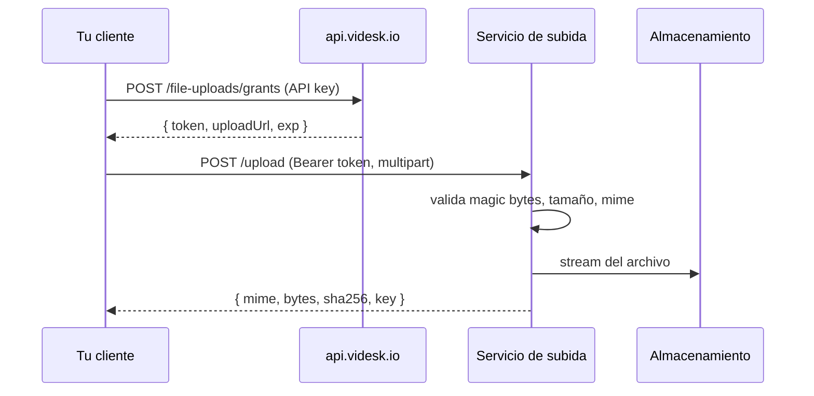

# Subida de archivos

Las subidas son un flujo de **dos pasos**:

1. **Solicitar una autorización** a `https://api.videsk.io` con tu API key. Recibes un JWT de corta duración y la URL de subida.
2. **Enviar el archivo** a la URL de subida usando ese JWT.




La autorización tiene en la práctica **semántica de un solo uso**: expira en 5 minutos y queda acotada a un único bucket, prefijo de key, lista de mime types permitidos y tamaño máximo. Reutilizarla es técnicamente posible hasta `exp`, pero deberías pedir una nueva por cada archivo.


### Autenticación

Ambos pasos usan **`Authorization: Bearer <token>`** pero con tokens distintos:

| Paso            | Endpoint                            | Token                            |
| --------------- | ----------------------------------- | -------------------------------- |
| 1. Autorización | `https://api.videsk.io`             | Tu **API key**                   |
| 2. Subida       | `uploadUrl` (devuelta en el paso 1) | El **JWT** devuelto en el paso 1 |


Nunca expongas tu API key en código de navegador. Genera la autorización desde tu backend y, si un usuario final sube el archivo directamente, pasale sólo el JWT de corta duración.


***

### Paso 1: Solicitar una autorización de subida

#### Endpoint

```
POST https://api.videsk.io/file-uploads/grants
```

#### Headers

```
Authorization: Bearer <TU_API_KEY>
Content-Type: application/json
```

#### Body

```json
{
  "purpose": "cip",
  "projectId": "65f0a1b2c3d4e5f6a7b8c9d0",
  "filename": "transcripcion.pdf"
}
```

**Campos**

| Campo       | Tipo   | Requerido   | Descripción                                                                                  |
| ----------- | ------ | ----------- | -------------------------------------------------------------------------------------------- |
| `purpose`   | string | sí          | Uno de los propósitos soportados (ver abajo).                                                |
| `projectId` | string | condicional | Requerido cuando `purpose=cip`. Debe referenciar un proyecto AI que pertenezca a tu cuenta.  |
| `filename`  | string | no          | Nombre original del archivo. Se usa para componer el key del objeto. Sanitizado server-side. |
| `size`      | number | no          | Tamaño declarado en bytes. Informativo; el servicio aplica `maxBytes` igual.                 |
| `mime`      | string | no          | Mime declarado. El servicio detecta el mime real desde los magic bytes.                      |

#### Respuesta

```json
{
  "token": "eyJhbGciOiJFZERTQSIsInR5cCI6IkpXVCJ9...",
  "exp": 1735689600,
  "uploadUrl": "https://files.videsk.io/upload",
  "credentialId": "b2-default"
}
```

| Campo          | Descripción                                                                        |
| -------------- | ---------------------------------------------------------------------------------- |
| `token`        | JWT firmado con EdDSA. Pasalo como `Authorization: Bearer <token>` en el paso 2.   |
| `exp`          | Timestamp Unix (segundos) en el que el token expira. \~5 minutos desde su emisión. |
| `uploadUrl`    | URL exacta a la que enviar el archivo. Usala tal cual.                             |
| `credentialId` | Credencial de almacenamiento utilizada (informativo, para auditoría).              |

#### Errores

| Status | Código                         | Significado                                         |
| ------ | ------------------------------ | --------------------------------------------------- |
| 400    | `unknown purpose`              | `purpose` no está en la lista permitida.            |
| 400    | `cip grants require projectId` | Falta `projectId` para `purpose=cip`.               |
| 401    | `unauthorized`                 | API key faltante o inválida.                        |
| 404    | `project not found`            | El `projectId` no existe o pertenece a otra cuenta. |

***

### Paso 2: Enviar el archivo

#### Endpoint

Debes usar el `uploadUrl` devuelto en el paso 1 tal cual:

```
POST https://portus.videsk.io/upload
```

#### Headers

```
Authorization: Bearer <TOKEN_DEL_PASO_1>
Content-Type: multipart/form-data; boundary=...
```

#### Body

Un único `multipart/form-data` con la parte llamada `file`:

```
--boundary
Content-Disposition: form-data; name="file"; filename="transcripcion.pdf"
Content-Type: application/pdf

<binario>
--boundary--
```

#### Respuesta (éxito)

```json
{
  "mime": "application/pdf",
  "bytes": 524288,
  "sha256": "9f86d081884c7d659a2feaa0c55ad015a3bf4f1b2b0b822cd15d6c15b0f00a08",
  "key": "65f0a1b2c3d4e5f6a7b8c9d0/65f0a1b2c3d4e5f6a7b8c9d1/f3d4-c5b6-transcripcion.pdf"
}
```

| Campo    | Descripción                                                                               |
| -------- | ----------------------------------------------------------------------------------------- |
| `mime`   | Mime detectado a partir de los magic bytes del archivo (no del `Content-Type` declarado). |
| `bytes`  | Tamaño final después del strip de EXIF / re-encoding.                                     |
| `sha256` | Digest hexadecimal del contenido subido. Útil para deduplicación.                         |
| `key`    | Path completo del objeto almacenado.                                                      |


Guarda `key` + `sha256` de ser necesario. Esos dos valores son todo lo que necesitas para referenciar, deduplicar o descargar el archivo más tarde.


#### Errores

| Status | Código                                      | Significado                                                                                                                 |
| ------ | ------------------------------------------- | --------------------------------------------------------------------------------------------------------------------------- |
| 401    | `unauthorized`                              | JWT faltante, mal formado, expirado o firmado con clave incorrecta.                                                         |
| 403    | `forbidden_credential` / `forbidden_bucket` | La autorización referencia una credencial o bucket no permitido. No debería ocurrir con autorizaciones emitidas por la API. |
| 413    | `too_large`                                 | El archivo excede el `maxBytes` de la autorización.                                                                         |
| 415    | `invalid_mime`                              | Los magic bytes no coinciden con los `allowedMimes` de la autorización. El `Content-Type` declarado se ignora.              |
| 400    | `bad_request`                               | No es multipart, falta la parte `file`, etc.                                                                                |

***

### Ejemplos



```bash
API_KEY="vk_live_xxxxxxxxxxxx"
PROJECT_ID="65f0a1b2c3d4e5f6a7b8c9d0"
FILE="./transcripcion.pdf"

# 1. Pedir autorización
GRANT=$(curl -sS -X POST https://api.videsk.io/file-uploads/grants \
  -H "Authorization: Bearer $API_KEY" \
  -H "Content-Type: application/json" \
  -d "{\"purpose\":\"cip\",\"projectId\":\"$PROJECT_ID\",\"filename\":\"$(basename "$FILE")\"}")

TOKEN=$(echo "$GRANT" | jq -r .token)
UPLOAD_URL=$(echo "$GRANT" | jq -r .uploadUrl)

# 2. Subir
curl -sS -X POST "$UPLOAD_URL" \
  -H "Authorization: Bearer $TOKEN" \
  -F "file=@$FILE;type=application/pdf"
```



```javascript
import { readFile } from 'node:fs/promises';
import { basename } from 'node:path';

async function subirAVidesk({ apiKey, projectId, filePath, mime }) {
  // 1. Pedir autorización
  const grantRes = await fetch('https://api.videsk.io/file-uploads/grants', {
    method: 'POST',
    headers: {
      Authorization: `Bearer ${apiKey}`,
      'Content-Type': 'application/json',
    },
    body: JSON.stringify({
      purpose: 'cip',
      projectId,
      filename: basename(filePath),
    }),
  });
  if (!grantRes.ok) throw new Error(`grant failed: ${await grantRes.text()}`);
  const { token, uploadUrl } = await grantRes.json();

  // 2. Subir
  const form = new FormData();
  const buf = await readFile(filePath);
  form.append('file', new Blob([buf], { type: mime }), basename(filePath));

  const upRes = await fetch(uploadUrl, {
    method: 'POST',
    headers: { Authorization: `Bearer ${token}` },
    body: form,
  });
  if (!upRes.ok) throw new Error(`upload failed: ${await upRes.text()}`);
  return upRes.json();
}

const result = await subirAVidesk({
  apiKey: process.env.VIDESK_API_KEY,
  projectId: '65f0a1b2c3d4e5f6a7b8c9d0',
  filePath: './transcripcion.pdf',
  mime: 'application/pdf',
});

console.log(result);
// { mime, bytes, sha256, bucket, key, provider, credentialId }
```



```python
import os
import requests

API_KEY = os.environ["VIDESK_API_KEY"]
PROJECT_ID = "65f0a1b2c3d4e5f6a7b8c9d0"
FILE_PATH = "./transcripcion.pdf"

# 1. Pedir autorización
grant = requests.post(
    "https://api.videsk.io/file-uploads/grants",
    headers={"Authorization": f"Bearer {API_KEY}"},
    json={
        "purpose": "cip",
        "projectId": PROJECT_ID,
        "filename": os.path.basename(FILE_PATH),
    },
    timeout=10,
)
grant.raise_for_status()
grant = grant.json()

# 2. Subir
with open(FILE_PATH, "rb") as fh:
    up = requests.post(
        grant["uploadUrl"],
        headers={"Authorization": f"Bearer {grant['token']}"},
        files={"file": (os.path.basename(FILE_PATH), fh, "application/pdf")},
        timeout=300,
    )
up.raise_for_status()
print(up.json())
```



***

### Buenas prácticas

#### Una autorización por archivo

Las autorizaciones son de corta duración. Aunque técnicamente sean reutilizables hasta `exp`, conviene que cada archivo tenga la suya para que los logs de auditoría mapeen 1:1 contra los objetos almacenados.

#### Confía en la detección de mime del servidor

El servicio ignora el `Content-Type` que declaras y lee los **magic bytes** reales del archivo. Un `.csv` con `Content-Type: image/png` se rechaza con `invalid_mime`. Siempre entrega el archivo original sin modificar.

#### Política de reintentos

* **400, 401, 403, 413, 415** — **no** reintentar, la respuesta no va a cambiar.
* **5xx, errores de red** — reintentar con backoff exponencial, **pidiendo una autorización nueva** si la anterior ya expiró.

#### Rate limits

Endpoint de autorización: 60 requests/minuto por API key. Endpoint de subida: sin límite por key, pero la concurrencia del servicio puede encolar requests en picos altos.

***

### Seguridad

* Los tokens de autorización están firmados con **EdDSA (Ed25519)**. El servicio de subida verifica cada request contra la clave pública.
* Cada autorización codifica el bucket exacto, prefijo de key, lista de mimes y tope de bytes. Un token comprometido no puede usarse fuera de ese alcance.
* Las imágenes pasan por `sharp().rotate()`, que **elimina toda la metadata EXIF** (incluyendo GPS) y aplica el flag de orientación antes de escribir al almacenamiento.
* El servicio cumple con SOC 2: las credenciales de almacenamiento están acotadas por bucket, así que el alcance de una credencial no puede alcanzar otro bucket.
