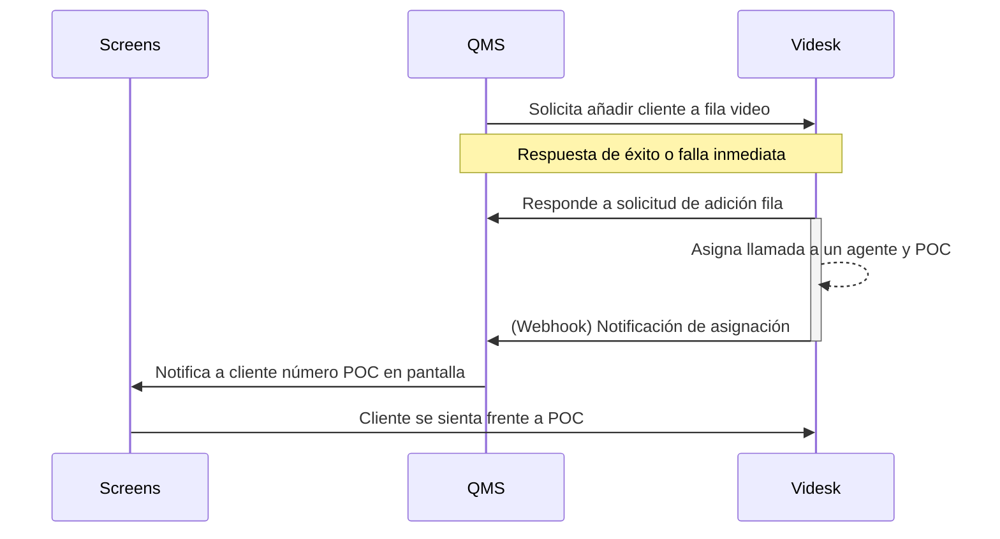

# QMS

Con nuestra Rest API de llamadas podrás generar llamadas en vivo para tus clientes de manera programática integrado con sistemas QMS (Queue management systems).

Los endpoints a continuación son públicos, es decir, se antepone `/public/` como medio diferenciador de endpoints privados.


Recomendamos hacer uso de los códigos de estados para aplicar lógica a tus integraciones.



Debido a la nomenclatura de sistemas QMS se menciona `queue`como referencia a segmentos, siendo similares.


## Consideraciones

Debes considerar que la forma de comunicación entre nuestro ACD y POCs (puntos de contactos) se realiza de forma automática. Cuando un ticket (llamada) se asigna a un ejecutivo y este contesta se dispara nuestro webhook QMS el cual se configura en cada cuenta.

Puedes ver más información en la [documentación de Webhooks](broken-reference).

### Flujo de integración

Glosario:

* QMS: Sistema de administración de filas (Queues Management System)
* POC: Puntos de contacto (Point of contact)
* Screens: Pantallas con turnos



## Solicitud de añadir a fila

<mark style="color:green;">`POST`</mark> `https://api.videsk.io/public/video-contact-center/branches/:branch/queues/:queue`

Solicitar añadir a la fila un ticket de QMS

#### Path Parameters

| Name                                     | Type   | Description          |
| ---------------------------------------- | ------ | -------------------- |
| branch<mark style="color:red;">\*</mark> | String | ID de oficina        |
| queue<mark style="color:red;">\*</mark>  | String | ID de fila (segment) |

#### Headers

| Name                                            | Type   | Description      |
| ----------------------------------------------- | ------ | ---------------- |
| Authorization<mark style="color:red;">\*</mark> | String | Backend API Key  |
| Content-Type<mark style="color:red;">\*</mark>  | String | application/json |

#### Request Body

<table><thead><tr><th width="201">Name</th><th width="117">Type</th><th>Description</th></tr></thead><tbody><tr><td>integrationData</td><td>Mixed</td><td>Datos del ticket (Array, Object o String)</td></tr><tr><td>form</td><td>String</td><td>ID del formulario</td></tr><tr><td>ticketId</td><td>String</td><td>Ticket ID legible por el cliente/agente</td></tr></tbody></table>



```json
{
    "id": "652a1ae848880e168884e49b",
    "segment": "Trámites ABC"
}
```

La respuesta contiene el ID interno del ticket en la fila y el nombre del segmento (fila)



```json
{
    "name": "NotFound",
    "message": "The segment for the branch \"1234567890\" is not assigned or the branch id is incorrect",
    "code": 404,
    "className": "not-found",
    "errors": {}
}
```



```json
{
    "name": "PreconditionRequired",
    "message": "Is mandatory to provide a forms submission id.",
    "code": 426,
    "className": "precondition-require",
    "errors": {}
}
```

Para más información de los errores generados por formulario visita la [documentación de formularios](formularios.md).



```json
{
    "name": "NotAcceptable",
    "message": "Not agent available in the segment \"652a1ae848880e168884e49b\", please try later.",
    "code": 406,
    "className": "not-acceptable",
    "errors": {}
}
```



```json
{
    "name": "Unprocessable",
    "message": "We're not able to request adding you to the queue, try again.",
    "code": 422,
    "className": "unprocessable",
    "errors": {}
}
```




El valor `integrationData`será usado para ser enviado mediante nuestros webhooks, por lo que es útil en caso que desees enviar un ID interno, metadata, etc. para la sincronización. **Tiene un límite de 50 Kb**, recibe cualquier tipo de dato `String`, `Objetcs`, `Arrays`, etc.


Esto no se mostrará al agente, solo estará disponible en los webhooks de integración.



El valor `ticketId` tiene un límite de 50 caracteres, mínimo 1.


## Obtener listado de oficinas

<mark style="color:blue;">`GET`</mark> `https://api.videsk.io/public/video-contact-center/branches`

Listado de oficinas usando API Key

#### Headers

| Name                                            | Type   | Description      |
| ----------------------------------------------- | ------ | ---------------- |
| Authorization<mark style="color:red;">\*</mark> | String | Backend API Key  |
| Content-Type<mark style="color:red;">\*</mark>  | String | application/json |



```json
[
    {
        "location": [
            7,
            9
        ],
        "label": "Virtual Main branch",
        "address": "1345 Main Street, CA",
        "name": "branch-main-1345",
        "id": "652720d479497a1b62df288b"
    }
]
```



## Obtener listado de filas

<mark style="color:blue;">`GET`</mark> `https://api.videsk.io/public/video-contact-center/branches/:branch/queues`

Listado de filas disponibles en la oficina

#### Headers

| Name                                            | Type   | Description      |
| ----------------------------------------------- | ------ | ---------------- |
| Authorization<mark style="color:red;">\*</mark> | String | Backend API Key  |
| Content-Type<mark style="color:red;">\*</mark>  | String | application/json |



```json
[
    {
        "name": "Atención a clientes",
        "id": "652a1ae848880e168884e49b",
        "users": 0,
        "avgWaitingTime": 1.124
    }
]
```

La respuesta incluye `users` que corresponde al número de agentes disponibles para realizar un atención inmediata.



```json
{
    "name": "NotFound",
    "message": "The branch was not found",
    "code": 404,
    "className": "not-found",
    "errors": {}
}
```



## Obtener información fila

<mark style="color:blue;">`GET`</mark> `https://api.videsk.io/public/video-contact-center/branches/:branch/queues/:queue`

Obtén información de una fila individual

#### Headers

| Name                                            | Type   | Description      |
| ----------------------------------------------- | ------ | ---------------- |
| Authorization<mark style="color:red;">\*</mark> | String | Backend API Key  |
| Content-Type<mark style="color:red;">\*</mark>  | String | application/json |



```json
{
    "name": "Atención a clientes",
    "id": "652a1ae848880e168884e49b",
    "users": 1,
    "avgWaitingTime": 1.124
}
```



```json
{
    "name": "NotFound",
    "message": "The branch or segment was not found",
    "code": 404,
    "className": "not-found",
    "errors": {}
}
```



## Postman collection

Puedes clonar nuestra colección de postman exclusiva para integración QMS:


Colección Postman


La colección incluye un flow para mejor entendimiento de cómo realizar la integración.
