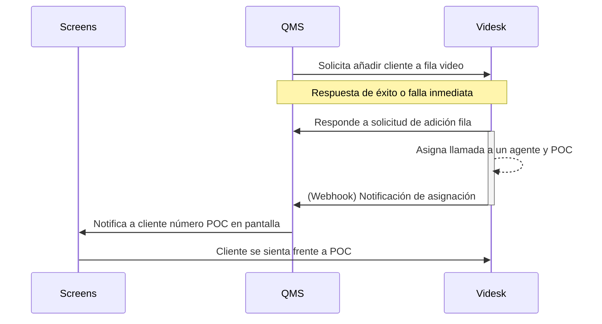

# QMS

Con nuestra Rest API de llamadas podrás generar llamadas en vivo para tus clientes de manera programática integrado con sistemas QMS (Queue management systems).

Los endpoints a continuación son públicos, es decir, se antepone `/public/` como medio diferenciador de endpoints privados.


Recomendamos hacer uso de los códigos de estados para aplicar lógica a tus integraciones.



Debido a la nomenclatura de sistemas QMS se menciona `queue`como referencia a segmentos, siendo similares.


## Consideraciones

Debes considerar que la forma de comunicación entre nuestro ACD y POCs (puntos de contactos) se realiza de forma automática. Cuando un ticket (llamada) se asigna a un ejecutivo y este contesta se dispara nuestro webhook QMS el cual se configura en cada cuenta.

Puedes ver más información en la [documentación de Webhooks](broken-reference).

### Flujo de integración

Glosario:

* QMS: Sistema de administración de filas (Queues Management System)
* POC: Puntos de contacto (Point of contact)
* Screens: Pantallas con turnos





Solicitar añadir a la fila un ticket de QMS



Backend API Key



Datos del ticket (Array, Object o String)



ID de oficina



ID de fila (segment)



ID del formulario



application/json



```json
{
    "id": "652a1ae848880e168884e49b",
    "segment": "Trámites ABC"
}
```

La respuesta contiene el ID interno del ticket en la fila y el nombre del segmento (fila)



```json
{
    "name": "NotFound",
    "message": "The segment for the branch \"1234567890\" is not assigned or the branch id is incorrect",
    "code": 404,
    "className": "not-found",
    "errors": {}
}
```



```json
{
    "name": "NotAcceptable",
    "message": "Not agent available in the segment \"652a1ae848880e168884e49b\", please try later.",
    "code": 406,
    "className": "not-acceptable",
    "errors": {}
}
```



```json
{
    "name": "Unprocessable",
    "message": "We're not able to request adding you to the queue, try again.",
    "code": 422,
    "className": "unprocessable",
    "errors": {}
}
```



```json
{
    "name": "PreconditionRequired",
    "message": "Is mandatory to provide a forms submission id.",
    "code": 426,
    "className": "precondition-require",
    "errors": {}
}
```

Para más información de los errores generados por formulario visita la [documentación de formularios](formularios.md).




El valor `integrationData`será usado para ser enviado mediante nuestros webhooks, por lo que es útil en caso que desees enviar un ID interno, metadata, etc. para la sincronización. **Tiene un límite de 50 Kb**, recibe cualquier tipo de dato `String`, `Objetcs`, `Arrays`, etc.


Esto no se mostrará al agente, solo estará disponible en los webhooks de integración.




Listado de oficinas usando API Key



Backend API Key



application/json



```json
[
    {
        "location": [
            7,
            9
        ],
        "label": "Virtual Main branch",
        "address": "1345 Main Street, CA",
        "name": "branch-main-1345",
        "id": "652720d479497a1b62df288b"
    }
]
```





Listado de filas disponibles en la oficina



Backend API Key



application/json



```json
[
    {
        "name": "Atención a clientes",
        "id": "652a1ae848880e168884e49b",
        "users": 0
    }
]
```

La respuesta incluye `users` que corresponde al número de agentes disponibles para realizar un atención inmediata.



```json
{
    "name": "NotFound",
    "message": "The branch was not found",
    "code": 404,
    "className": "not-found",
    "errors": {}
}
```





Obtén información de una fila individual



Backend API Key



application/json



```json
{
    "name": "Atención a clientes",
    "id": "652a1ae848880e168884e49b",
    "users": 1
}
```



```json
{
    "name": "NotFound",
    "message": "The branch or segment was not found",
    "code": 404,
    "className": "not-found",
    "errors": {}
}
```


