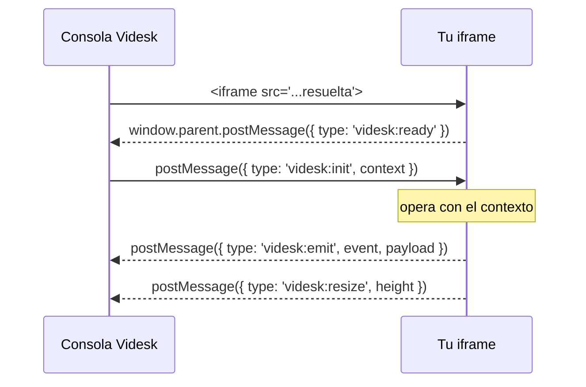

# Broker (postMessage)

El **broker** es el canal de mensajería entre la consola y tu iframe. Está implementado con la API estándar [`postMessage`](https://developer.mozilla.org/docs/Web/API/Window/postMessage); no se requiere ninguna librería ni SDK.

Todos los mensajes del protocolo usan el prefijo `videsk:` en el campo `type`. Mensajes con otro `type` o sin él se ignoran.

## Handshake e init

Cuando tu iframe termina de cargar, la consola envía el primer mensaje. Como no siempre está garantizado que tu app haya registrado su `message` listener antes del `load`, **tu app puede pedir el init explícitamente** con `videsk:ready`.



El mensaje `videsk:init` se entrega tanto al `load` del iframe como cada vez que recibimos un `videsk:ready`. Es seguro (e idempotente) escuchar siempre `videsk:init`.

## Mensajes

### Host → App

| `type` | Payload | Cuándo se envía |
| --- | --- | --- |
| `videsk:init` | `{ type, context }` | Al `load` del iframe y como respuesta a `videsk:ready`. |

El campo `context` contiene los bloques que declaraste en `contextScopes` (ver [Configuración](configuracion.md#contextscopes) y [Plantillas](plantillas.md) para el detalle de cada campo).

### App → Host

| `type` | Payload | Efecto |
| --- | --- | --- |
| `videsk:ready` | `{ type }` | Pide el `videsk:init` al host. |
| `videsk:resize` | `{ type, height: number }` | Ajusta la altura del iframe a `height` píxeles. |
| `videsk:emit` | `{ type, event: string, payload: any }` | Notifica un evento de negocio al host (ver patrones más abajo). |

## Validación de origen

El host valida el `event.origin` de cada mensaje contra el origin de la `iframe.url` configurada. Por ejemplo, si configuraste:

```json
"iframe": { "url": "https://apps.example.com/lookup" }
```

Solo se aceptan mensajes provenientes de `https://apps.example.com`. Mensajes de cualquier otro origen se descartan.

Por simetría, **te recomendamos** validar también el origen en tu app antes de actuar sobre un mensaje. Los dominios oficiales de Videsk son `https://console.videsk.io` y `https://app.videsk.io`.

```js
window.addEventListener('message', event => {
  const allowed = ['https://console.videsk.io', 'https://app.videsk.io'];
  if (!allowed.includes(event.origin)) return;
  // ...
});
```

## Patrones de uso

El broker resuelve dos casos de uso muy distintos. Identifica primero cuál aplica a tu app antes de diseñar el flujo.

### Patrón A — Broker como _habilitador_

El broker entrega un dato puntual (token, sessionId, id de cliente) y, a partir de ahí, tu app **vive sola**: hace sus propias llamadas a tu backend, autentica al usuario, etc. La consola es solo el detonante.

Cuándo usarlo:

* La app tiene su propia sesión y solo necesita saber "quién es el agente" o "qué llamada es".
* Tu backend es la fuente de verdad y la consola no necesita enterarse de lo que pasa dentro.
* Quieres un flujo simple: una vez inicializado, no hay más mensajes.

```js
window.parent.postMessage({ type: 'videsk:ready' }, '*');

window.addEventListener('message', event => {
  if (event.data?.type !== 'videsk:init') return;
  const { user, call } = event.data.context;
  // a partir de aquí, tu app autentica contra tu backend con su propio token
  bootstrapMyApp({ agentEmail: user.email, callId: call?.id });
});
```

### Patrón B — Broker como _canal continuo_

La app y el host conversan durante toda la llamada. La app emite eventos cuando ocurren cosas relevantes (ej. "lead creado", "ticket cerrado") y/o ajusta su altura cuando su contenido cambia.

Cuándo usarlo:

* El agente debe ver feedback en tiempo real (resize, notificaciones).
* Quieres registrar acciones del agente en el contexto de la llamada de Videsk.
* La altura de tu UI cambia y necesitas que el iframe se acomode.

```js
// auto-resize cuando cambia el alto del documento
new ResizeObserver(() => {
  window.parent.postMessage({
    type: 'videsk:resize',
    height: document.documentElement.scrollHeight,
  }, '*');
}).observe(document.documentElement);

// notificar al host que se creó un lead
function onLeadCreated(lead) {
  window.parent.postMessage({
    type: 'videsk:emit',
    event: 'lead.created',
    payload: { id: lead.id, name: lead.name },
  }, '*');
}
```

Los dos patrones no son excluyentes: una app puede recibir un token vía `videsk:init` (Patrón A) y, además, emitir eventos durante su uso (Patrón B).

## Buenas prácticas

* **No codifiques datos sensibles en la URL.** Si tu app necesita un token, considera generarlo desde tu backend en lugar de pasarlo por query string. Como segunda opción, recíbelo por el `videsk:init`.
* **Filtra siempre por `type`.** Otros scripts de la página (extensiones del navegador, librerías) también pueden emitir `message`. Verifica que `event.data.type === 'videsk:init'` antes de leer.
* **No spamees `videsk:resize`.** Úsalo cuando la altura realmente cambia (con `ResizeObserver` o equivalente). Decenas de mensajes por segundo degradan la consola.
* **Usa `contextScopes` mínimos.** Solo recibirás los bloques que declaras: pedir todo "por si acaso" expone datos innecesarios a tu app.
