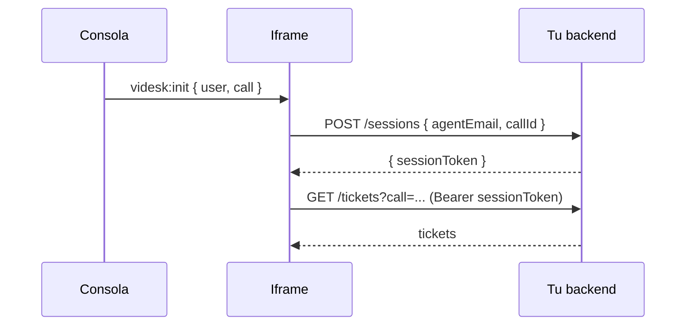

# Habilitar una sesión externa

Este ejemplo cubre el [Patrón A](../broker.md#patron-a-broker-como-habilitador): la consola entrega los identificadores mínimos y, a partir de ahí, tu app habla directamente con tu backend con su propio mecanismo de autenticación.

Es el patrón recomendado cuando:

* Tu app ya tiene su propio login/SSO.
* Quieres evitar pasar tokens o emails sensibles en el query string.
* La consola solo necesita "abrir la puerta" y la conversación posterior no le incumbe.

## Flujo



## Iframe

```html
<!doctype html>
<html>
<body>
  <div id="app">Iniciando…</div>
  <script>
    const TRUSTED = ['https://console.videsk.io', 'https://app.videsk.io'];

    async function bootstrap(context) {
      // 1. Pide a TU backend un token de sesión a partir del id del agente
      //    y la llamada. Tu backend decide si confía en esta solicitud
      //    (por ejemplo, validando el dominio de origen, IP, etc.).
      const res = await fetch('https://api.tu-app.com/sessions', {
        method: 'POST',
        headers: { 'Content-Type': 'application/json' },
        body: JSON.stringify({
          agentEmail: context.user?.email,
          callId: context.call?.id,
        }),
      });
      const { sessionToken } = await res.json();

      // 2. A partir de aquí tu app vive sola.
      renderTickets(sessionToken, context.call?.id);
    }

    async function renderTickets(token, callId) {
      const res = await fetch(`https://api.tu-app.com/tickets?call=${callId}`, {
        headers: { Authorization: `Bearer ${token}` },
      });
      const tickets = await res.json();
      document.getElementById('app').textContent =
        `Tickets: ${tickets.length}`;
    }

    window.addEventListener('message', (event) => {
      if (!TRUSTED.includes(event.origin)) return;
      if (event.data?.type !== 'videsk:init') return;
      bootstrap(event.data.context);
    });

    window.parent.postMessage({ type: 'videsk:ready' }, '*');
  </script>
</body>
</html>
```

## Configuración

```jsonc
{
  "name": "Mis tickets",
  "kind": "iframe",
  "placement": "sidebar",
  "iframe": { "url": "https://tickets.tu-app.com/embed" },
  "contextScopes": ["user", "call"]
}
```


Nota cómo la URL **no** contiene secretos ni datos del cliente final. Todo lo necesario llega por `videsk:init`, y el `sessionToken` lo emite tu backend, no Videsk.


## Alternativa: token en la URL

Si tu app no puede iniciar sesión por su cuenta y necesita un token desde el primer request, puedes generarlo en tu backend, exponerlo en una redirección y configurar la `iframe.url` apuntando a esa redirección. **Evita** poner tokens estáticos directamente en la URL configurada en consola.
