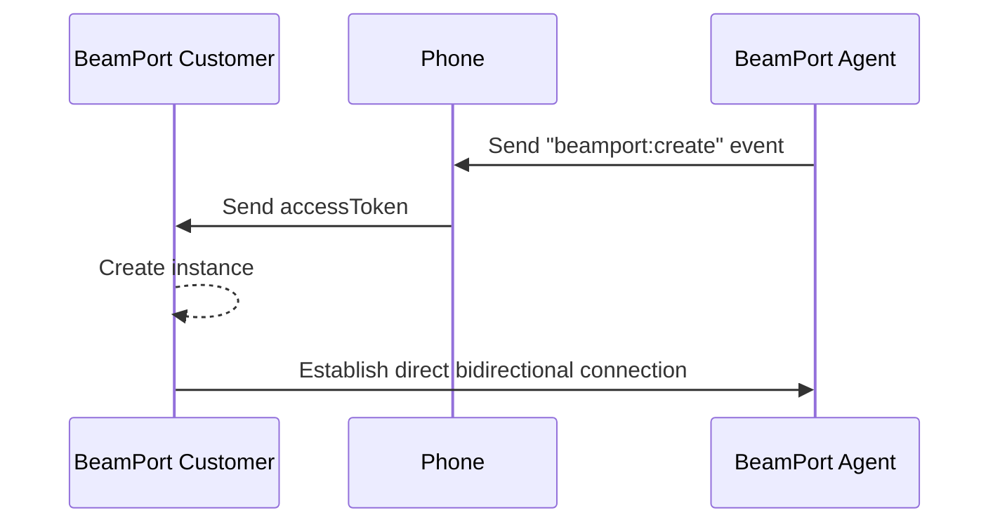

# 📂 File exchange

`BeamPort` allows you to easily exchange files, allowing you to define your own interface or flows.


The documentation and resources necessary to use `BeamPort` is strictly restricted for use by Videsk customers. We reserve the right to restrict its access and use, if we detect inadequate use.


## Installation

To use file exchange you need to load:



```html
<script src="https://cdn.videsk.io/sdk/beamport.min.js" async></script>
```



```javascript
const script = document.createElement('script');
script.src = "https://cdn.videsk.io/sdk/beamport.min.js";
script.setAttribute('async', true);
document.appendChild(script);
```



## Instantiation

To get started you will need to instantiate a new `BeamPort`.

```javascript
const port = new BeamPort();
```


You should only create 1 `BeamPort` per call, otherwise the behavior will not be as expected.


The following describes the flow for creating a `BeamPort` instance, considering that it is initially triggered from the agent side by sending a connection request through [`Phone SDK`](../phone/).



## Considerations

1. We use the file contents as identification by calculating a CRC-32, so two files that are byte-for-byte identical will not be sent.
2. We use a chunking algorithm for network balancing.
3. Each sending verifies the integrity of the file through CRC-32 chunking.
4. Each chunk received is checked for integrity with the remote peer, otherwise it is retried.
5. The limit of the file size is given by the memory of the sending and receiving device. We recommend sending files not larger than 2GB.
6. The sending finishes when the CRC-32 calculation is equivalent to that of the sending peer.
7. `BeamPort` will automatically reconnect whenever there is a network disconnection.


To send files, you will need to know more about the `BeamPort` methods, events, and properties:

<table data-view="cards"><thead><tr><th></th><th></th><th></th><th data-hidden data-card-target data-type="content-ref"></th></tr></thead><tbody><tr><td><strong>Methods</strong></td><td>Learn about the BeamPort methods and how to use them.</td><td></td><td><a href="methods.md">methods.md</a></td></tr><tr><td><strong>Events</strong></td><td>Know the BeamPort events and how to use them.</td><td></td><td><a href="events.md">events.md</a></td></tr><tr><td><strong>Properties</strong></td><td>Learn about the properties of a BeamPort.</td><td></td><td><a href="properties.md">properties.md</a></td></tr></tbody></table>