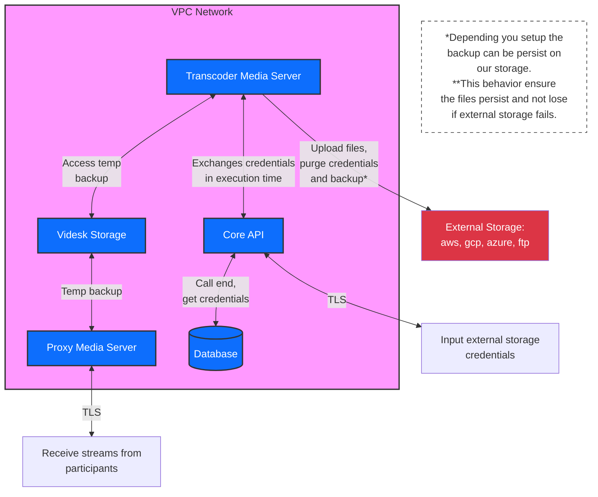

# Seguridad

Te explicamos como operamos a nivel de seguridad con las grabaciones tanto en tiempo de ejecución como en almacenamiento de las mismas (reposo).


Estamos escribiendo la documentación nuestros procedimiento y diseños de esta función en términos de seguridad.


## Credenciales

Todas las credenciales se almacenan de forma segura como llaves privadas, tokens, nombre de usuarios, URLs de conexión, etc. Es decir, toda información que no debería ser visible por nadie, **nunca**.


Accedemos a las credenciales solo en tiempo de ejecución de forma aislada, permitiendo que luego de subir las grabaciones se purge todo rastro de la memoria. **Nadie del personal de Videsk tiene acceso a ellas.**


El cifrado y descifrado utilizado para el almacenamiento de credenciales en reposo es AES-256-CBC.

En el siguiente esquema explicamos como se realiza el proceso de almacenamiento y transacción de las credenciales.


Las credenciales tienen un límite de 5000 caracteres como máximo.

Si posees un certificado x509 o similar de mayor longitud, puedes aumentar este tamaño contáctanos a **support@videsk.io**.


## Infraestructura

La infraestructura de grabación fue diseñada con la seguridad como pilar número uno. Utilizamos tecnología `realtime` para grabar las videollamadas y cada video/audio de cada participante lo que nos permite escalar a millones de grabaciones en paralelo y generando una aislación de todas las grabaciones que se realizan en nuestra plataforma.

El almacenamiento temporal o persistente se realiza en nuestra infraestructura privada, donde solo ciertos empleados de Videsk tienen acceso dependiendo de sus roles como DevOps o ciberseguridad. Siendo solo permisos de cambio de configuración de buckets y replicación de datos sin poder visualizarlos o modificarlos.

## Redundancia

Todas las grabaciones se respaldan en nuestra infraestructura de forma temporal o persistente.&#x20;

Solo si configuras el respaldo en nubes de terceros, luego de confirmar la subida exitosa, eliminamos el respaldo en su totalidad, de lo contrario mantenemos un respaldo accesible desde tu dashboard para que luego puedas solicitar el envío manualmente.

Esta configuración nos permite entregar redundancia sobre las grabaciones para evitar pérdidas indeseadas, si tu proveedor de almacenamiento presenta fallas.


Realizamos una facturación mínima de 100GB para asegurar disponibilidad de redundancia para tu cuenta.


## Integridad

Verificamos la integridad de las grabaciones y archivos mediante criptografía utilizando generación y verificación SHA-256, y para verificación de integridad en tránsito utilizamos verificación por redundancia cíclica o CRC-32.

Esto nos permite asegurar la integridad de las grabaciones en reposo y transporte, de esta forma ataques como Man-in-the-middle, mutaciones o similares sean mitigados.


Puedes verificar el hash de cada archivo luego de descargar.

