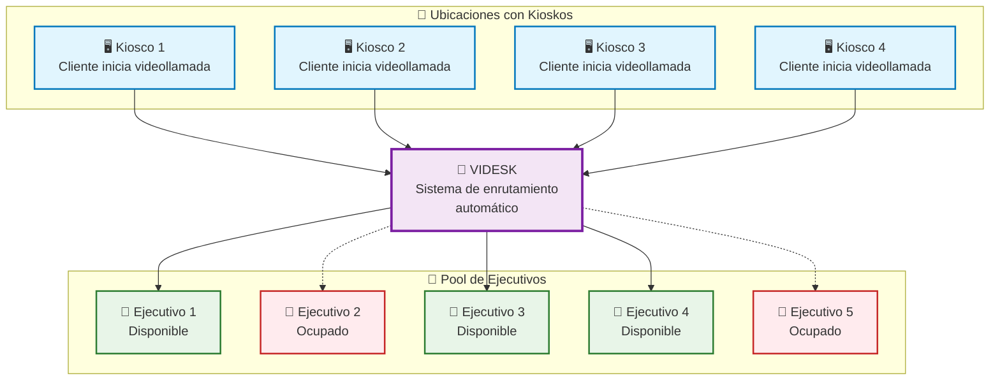
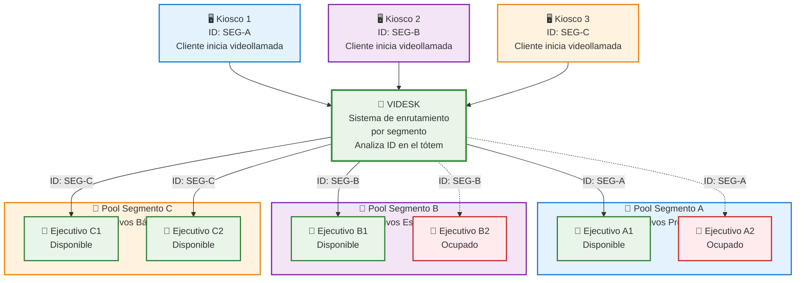

# Kioscos

Disponemos de recursos para que puedas utilizar Videsk en kioscos bajo diferentes ambientes.


[modo-kiosko.md](modo-kiosko.md)


## Arquitectura

Para el caso de los kioscos debes considerar que dependiendo de tu necesidad podrías requerir ajustar la forma de generar llamadas o agendamientos.

## Sin segmentación



En el caso de kioscos sin realizar segmentación por ubicación o propósito específico simplemente deberás usar nuestros widgets, SDKs o APIs para generar las llamadas o agendamientos, Videsk se encargará de derivar a quien corresponda.

## Con segmentación



Para estos casos que requieren una clara segmentación ya sea por tipo de cliente, productos, servicios o ubicación geográfica, deberás asignar los IDs de los segmentos correspondientes en cada kiosco, de manera que al momento de realizar la llamada se identifique el origen. Para realizar esto tienes varias maneras dependiendo de las capacidades y formas de integración de tus kioscos:


Recuerda que puedes obtener manualmente los IDs de segmento y calendarios desde el dashboard, también usando nuestra [Rest API](broken-reference).


### Widgets

Si estás usando nuestros widgets en tus kioscos, basta con usar el modelo de diferenciación por URL, descrita a continuación:


[url-triggers.md](../../widgets/url-triggers.md)


### SDKs y Rest API

Si estás usando nuestros SDKs y/o Rest API en tus kioscos, tendrás que obtener el ID de segmento ya sea manualmente desde nuestro dashboard o bien programáticamente con el SDK ([Phone](../../sdks/phone/) o [Calendar](../../sdks/calendario/)) o vía [Rest API](broken-reference). Por lo tanto los pasos son:

1. Obtener ID segmento(s) o calendario(s)
2. Almacenar vía URL, localStorage, etc. **La forma que obtengan y guardes estos IDs dependerá de tu elección técnica**.
3. Usar el ID de segmento o calendario a través de nuestros SDKs o Rest API.


Recuerda que la manera de almacenar los IDs dependerá de tu decisión técnica.


#### Ejemplo de almacenamiento/obtención:


Si necesitas obtener ID dinámicos, deberás diseñar tu propia solución donde recomendamos utilizar nuestra Rest API.



```javascript
class Storage {
  
  static storageKey = 'kiosk-id';
  
  static get fromWindow() {
    return window[this.storageKey];
  }
  
  static get fromUrl() {
    return new URLSearchParams(window.location.search).get(this.storageKey);
  }
  
  static save(id) {
    localStorage.setItem(this.storageKey, id);
  }
  
  static get id() {
    return localStorage.getItem(this.storageKey) || this.fromUrl || this.fromWindow;
  }
  
}

Storage.id // Obtener ID de segmento automáticamente por storage, URL y window
Storage.save(id) // Almancenar en storage local del navegador
```

