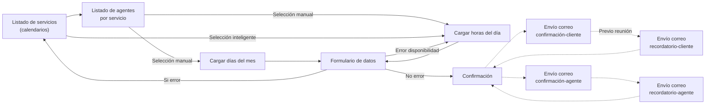
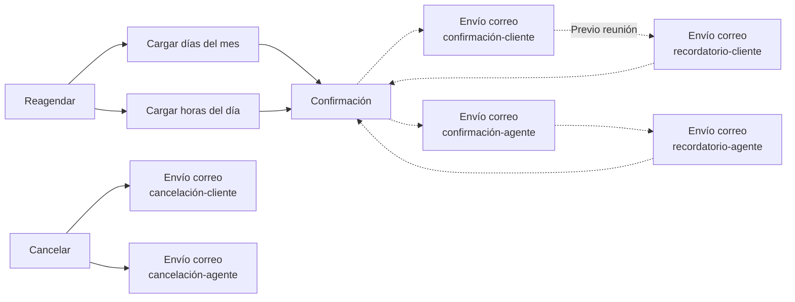

# 📅 Calendario

Con este SDK podrás embeber y diseñar de forma programática calendarios para agendar, sin necesidad de preocuparte por las conexiones, parámetros, excepciones, etc.

Es decir, hemos creado este "enchufe" para llegar y usar de forma sencilla y una estructura de rápido aprendizaje, pero sin dejar de lado la flexibilidad y poder de nuestra API.


Este SDK no provee interfaz, es decir, no hay código HTML, por lo que deberás manejar tu propia interfaz, ya sea en HTML puro, Javascript o con frameworks como Vue, React, Angular, Svelte, etc.


## Instalación

Para comenzar deberás instalar nuestro recurso en tu sitio web o aplicación móvil. Tienes las siguientes alternativas.



```html
<script src="https://cdn.videsk.io/sdk/calendar.min.js"></script>
```



```javascript
const script = document.createElement('script');
script.src = "https://cdn.videsk.io/sdk/calendar.min.js";
document.body.appendChild('body'); // O reemplaza con el nodo DOM que desees
```




No almacenes el contenido del script en tu servidor, **esto infringe nuestros términos de uso**.



Por seguridad y calidad de servicio tenemos un límite de peticiones por segundo por IP/Token, que consta de 20 peticiones en 1 segundo. Evita superar este límite, ya que nuestra Rest API bloqueará las peticiones de tus clientes.


## Instanciar

Lo primero que debes hacer es instanciar una clase `Calendar`. El primer argumento corresponden al token de integración que obtienes de tu cuenta.

```javascript
const calendar = new Calendar(token);
```

Posteriormente puedes acceder a sus métodos y propiedades.

<table data-card-size="large" data-view="cards"><thead><tr><th></th><th></th><th></th><th data-hidden data-card-target data-type="content-ref"></th><th data-hidden data-card-cover data-type="files"></th></tr></thead><tbody><tr><td><strong>Métodos</strong></td><td>Conoce cómo usar los métodos de Calendar SDK.</td><td></td><td><a href="metodos.md">metodos.md</a></td><td></td></tr><tr><td><strong>Propiedades</strong></td><td>Conoce cuáles son las propiedades de Calendar SDK.</td><td></td><td><a href="propiedades.md">propiedades.md</a></td><td></td></tr></tbody></table>

## Flujos

A continuación, puedes observar los dos tipos de flujos existentes, agendamiento y modificación. Te sugerimos leer con detención de esta manera tendrás una visión global de cada uno de los pasos involucrados en el agendamiento.

### Agendamiento

Este flujo corresponde al inicial, cuando un cliente desea agendar una reunión por primera vez.


El envío de recordatorios puede suceder hasta 4 veces en diferentes periodos según la configuración realizada, ambas para cliente y agente.



Los posibles errores que pueden surgir es agendar unos segundos antes de la hora seleccionada, por ejemplo: Agendar para las 14:05:00 a las 14:04:59.


También es posible que se niege el agendamiento si alguien más ha toma la hora al mismo tiempo, solo si hay 1 agente u hora disponible.





### Modificación

Este flujo corresponde al momento en que un cliente desea cancelar o reagendar una cita previamente solicitada.


Este flujo siempre se debe realizar con los tokens enviados por correo electrónico u otro medio seleccionado. Por seguridad no existen PINs, claves o búsqueda por correo para efectuar modificaciones.




