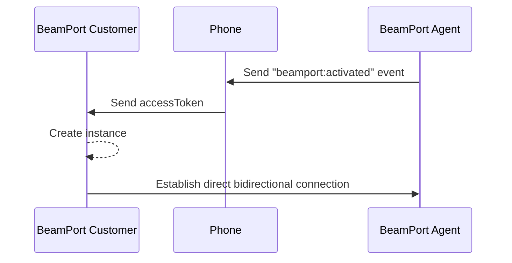

# 📂 Intercambio archivos

`BeamPort` te permite intercambiar de archivos de forma sencilla, permitiendo definir tu propia interfaz o flujos.


La documentación y recursos necesarios para utilizar `BeamPort` está estrictamente restringido para uso de clientes de Videsk. Nos reservamos el derecho de restringir su acceso y uso, si detectamos un uso inadecuado.


## Instalación

Para utilizar el intercambio de archivo necesitas cargar:



```html
<script src="https://cdn.videsk.io/sdk/beamport.min.js" async></script>
```



```javascript
const script = document.createElement('script');
script.src = "https://cdn.videsk.io/sdk/beamport.min.js";
script.setAttribute('async', true);
document.appendChild(script);
```



## Instanciación

Para comenazar deberás instanciar un nuevo `BeamPort`.

```javascript
const port = new BeamPort();
```


Debes crear solo 1 `BeamPort` por cada llamada, de lo contrario el comportamiento no será el esperado.


A continuación, se describe el flujo para la creación de una instancia `BeamPort`, considerando que inicialmente se desencadena desde el lado del agente enviando una solicitud de conexión a través de [`Phone SDK`](../phone/).



## Consideraciones

1. Utilizamos como identificación el contenido del archivo calculando un CRC-32, por lo que no se enviarán dos archivos idénticos en bytes.
2. Posee un algorítmo de envío por trozos (chunks) para balanceo de red.
3. Cada envío verifica la integridad del archivo mediante CRC-32 chunking.
4. Se verifica la integridad cada trozo recibido con el par remoto, de lo contrario se reintenta.
5. El límite del tamaño del archivo está dado por la memoria del dispositivo emisor y receptor. Recomendamos enviar archivos no superiores a 2GB.
6. El envío finaliza cuando el cálculo de CRC-32 es equivalente al del par emisor.
7. `BeamPort` realizará reconexiones automáticas cuando existan desconexiones por red.


Para enviar archivos deberás conocer más de los métodos, eventos y propiedades de `BeamPort`:

<table data-view="cards"><thead><tr><th></th><th></th><th></th></tr></thead><tbody><tr><td><strong>Métodos</strong></td><td>Conoce cuáles y cómo usar los métodos de BeamPort.</td><td></td></tr><tr><td><strong>Eventos</strong></td><td>Conoce cuáles y cómo usar los eventos de BeamPort.</td><td></td></tr><tr><td><strong>Propiedades</strong></td><td>Conoce cuáles son las propiedades de un BeamPort.</td><td></td></tr></tbody></table>
