# 🖼️ Iframes

Si requieres embeber un sitio donde esté el widget presente a través de un `iframe`, debes tener en consideración que existen requisitos de seguridad a cumplir para que no existan conflictos en el uso de cámara, micrófono, pantalla completa, gps, etc.

## Atributos

Lo primero que debes considerar es que debes añadir dos atributos olbigatorios `allow` y `allowfullscreen`, de lo contrario no funcionará correctamente el embebido.

```html
<iframe src="..." allow="camera; microphone; autoplay; fullscreen; picture-in-picture" allowfullscreen="true"></iframe>
```

### Permisos extras

Si requieres de otros permisos como GPS, giroscopio, sensor de luz, etc. deberás añadirlos al atributo `allow` basado en la [documentación MDN](https://developer.mozilla.org/en-US/docs/Web/HTTP/Permissions_Policy).


```html
<iframe 
  src="https://tu-aplicacion.com" 
  allow="camera; microphone; autoplay; fullscreen; picture-in-picture; geolocation; gyroscope; accelerometer"
  allowfullscreen="true"
  sandbox="allow-same-origin allow-scripts allow-popups allow-forms allow-modals"
  width="400" height="600">java</iframe>
```


**Explicación de Atributos**

<table><thead><tr><th width="273.33331298828125">Atributo</th><th width="344.555419921875">Proósito</th><th data-type="checkbox">Requerido</th></tr></thead><tbody><tr><td><code>allow="autoplay"</code></td><td>Permite reproducción automática de audio/video</td><td>true</td></tr><tr><td><code>allow="camera"</code></td><td>Acceso a la cámara del dispositivo</td><td>true</td></tr><tr><td><code>allow="microphone"</code></td><td>Acceso al micrófono del dispositivo</td><td>true</td></tr><tr><td><code>allow="fullscreen"</code></td><td>Permite modo pantalla completa</td><td>true</td></tr><tr><td><code>allowfullscreen="true"</code></td><td>Atributo legacy para pantalla completa</td><td>true</td></tr><tr><td><code>allow="picture-in-picture"</code></td><td>Modo picture-in-picture</td><td>false</td></tr><tr><td><code>allow="geolocation"</code></td><td>GPS (si usas funciones de localización)</td><td>false</td></tr></tbody></table>

## ⚠️ Consideraciones Importantes

```mermaid
graph LR
    A[Chrome/Edge] --> B["Autoplay solo con:<br/>• Muted<br/>• User interaction<br/>• MEI score alto"]
    C[Firefox] --> D["Autoplay bloqueado<br/>por defecto"]
    E[Safari] --> F["Políticas estrictas<br/>Requiere user gesture"]
    G[Mobile Browsers] --> H["Restricciones<br/>más estrictas"]
```



## Usando librerías

También te sugiremos para evitar problemas de dominio cruzado el uso de nuestra librería de código abierto [iFrameX](https://github.com/videsk/iFrameX), que te permitirá crear iframes sin necesidad de un source diferente al actual, inyectando el contenido Javascript, CSS y HTML de forma dinámica.


