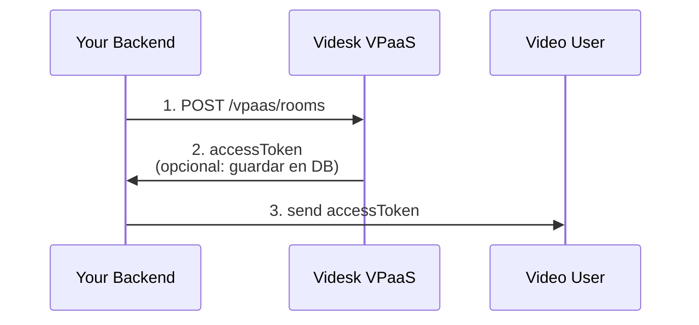
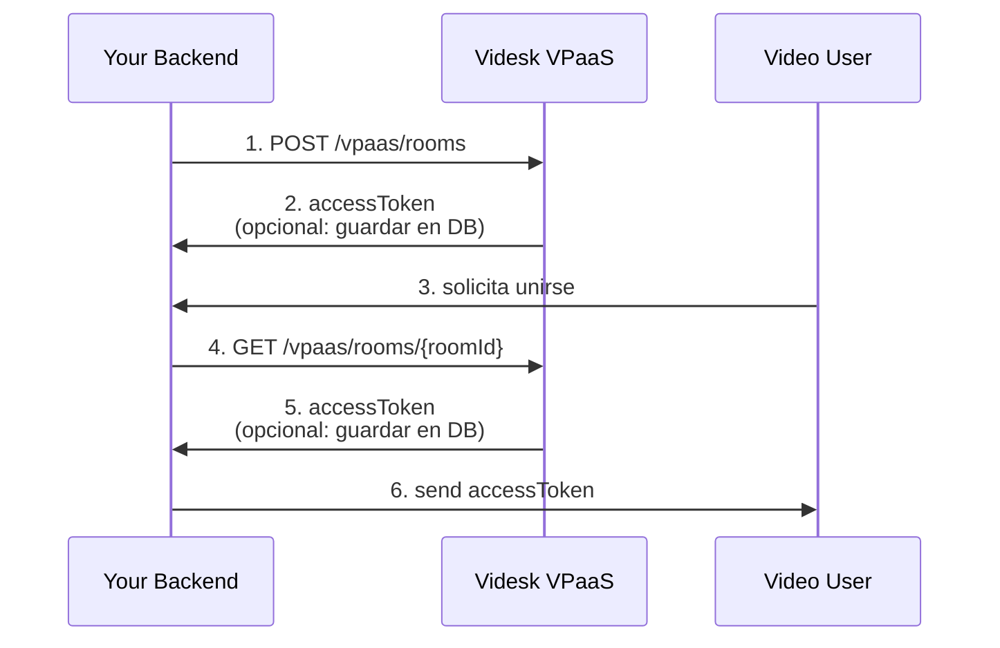
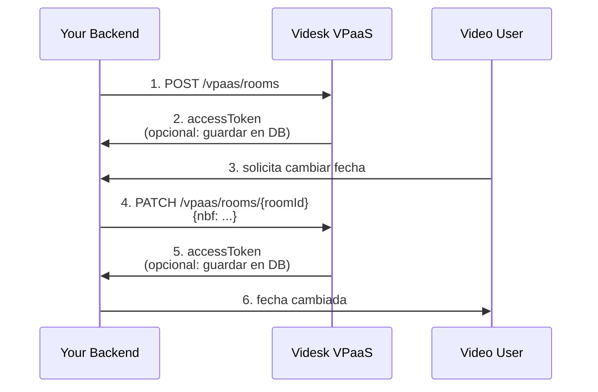

# Introducción

Antes de comenzar, debes saber que el diseño de nuestra API VPaaS está diseñado para simplificar el desarrollo de aplicaciones de videollamada. Por ello entregamos los siguientes mecanismos únicos en su clase:


* Stateless: puedes usar tus propios IDs al crear salas, pudiendo buscar salas y volver a generar tokens usando tu propio ID.
* &#x20;Expirable: Indicando fecha de inicio (opcional) y término (opcional), automáticamente concederemos o denegaremos acceso a las salas basado en las fechas indicadas.

***

## Límites

Por defecto, permitimos un acceso máximo de 3 horas por sala, el cual se puede sobreescribir hasta 72 horas con la key `exp` en los endpoints: [#post-vpaas-rooms](rooms-api.md#post-vpaas-rooms "mention") y [#patch-vpaas-rooms-roomid](rooms-api.md#patch-vpaas-rooms-roomid "mention").

La fecha de expiración es 3 horas después de la fecha de solicitud de creación de sala. Puedes reemplazar este comportamiento definiendo `exp` como fecha. Al mismo tiempo, `nbf` por defecto se define en la fecha de creación de la sala.

#### Rate limit

Actualmente, para todos los clientes, el límite de solicitudes por segundo es de 20. Esta restricción la podrás leer directamente desde nuestras cabeceras:


* `Ratelimit-Limit`: indica req/s de tu cuenta, defecto: 20
* `Ratelimit-Remaining`: total de solicitudes disponibles en la siguiente ventana de 1 s
* `Ratelimit-Reset`: indica la ventana de tiempo en que se restablecerá el límite, defecto: 1
* `Ratelimit-Policy`: Indica la política en formato 2020 [estándar propuesto](https://www.ietf.org/archive/id/draft-polli-ratelimit-headers-02.html).


En caso de que tengas un aumento de solicitudes por segundo, puedes contactar con soporte o tu ejecutivo de ventas para ampliar este límite.


***

## Seguridad

Puedes limitar qué IPs pueden realizar la creación de salas a través de los endpoints disponibles[rooms-api.md](rooms-api.md "mention").

Este formato pueden ser IPv4s, IPv6s o bien CIDRs, lo cual validaremos en cada solicitud.


Recomendamos que, para ambientes de desarrollo, evites definir una lista blanca; de esta manera podrás testear localmente sin restricciones.



En caso que evidencies alguna vulnerabilidad puedes contactarnos a [security@videsk.io](mailto:security@videsk.io), o bien podrás encontrar nuestros contactos en las cabeceras HTTP `X-Security-Report` y `X-Security-Site` en todos nuestros dominios y subdominios.      &#x20;


***

## Casos de uso

### Salas on-demand

Este caso de uso describe el flujo de crear una sala on-demand para acceso inmediato, lo que consigues usando nuestro endpoint [#post-vpaas-rooms](rooms-api.md#post-vpaas-rooms "mention").




### Salas agendadas

Este caso describe cómo crear una sala para el futuro, donde podrás indicar opcionalmente la fecha de inicio y fin, asegurando que no se pueda ingresar antes de la fecha de inicio y que se pueda expulsar automáticamente después de la fecha indicada.

Esto se consigue definiendo el cuerpo de la solicitud para el [#post-vpaas-rooms](rooms-api.md#post-vpaas-rooms "mention")

```json
{
    "exp": "2042-08-14T18:00:00.000Z", // Fecha de término
    "bnf": "2042-08-14T16:50:00.000Z" // Fecha de inicio
}
```



### Actualizar fecha de inicio

Este caso describe la situación de crear una sala y posteriormente la necesidad de actualizar la fecha de inicio a través del endpoint [#patch-vpaas-rooms-roomid](rooms-api.md#patch-vpaas-rooms-roomid "mention").

```json
{
    "nbf": "2042-08-17T09:25:00.000Z"
}
```


